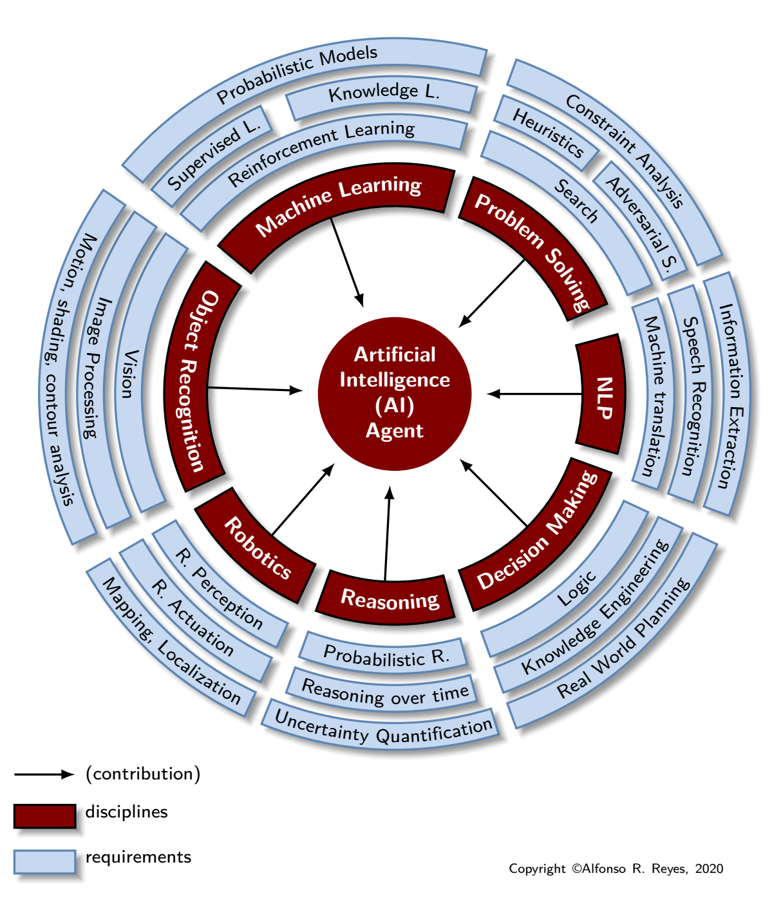

# Why Machine Learning is not Artificial Intelligence?

It is simple: because **ML** is only a contributing branch of **AI**. If we follow Norvig and Russell book -and other authors-, saying that **machine learning** is part of **artificial intelligence** is grossly misleading, **ML** is a contributing discipline of **AI**, just like search, reasoning, decision making, natural language processing, image recognition, robotics, etc. 

For instance, **ML** by itself cannot be intelligent because lacks reasoning, logic, and doesn’t interact with the environment. **ML** detects patterns based on statistical analysis of data using *math based algorithms*. These **algorithms** are not intelligent per se. 

Intelligence is much more than that. 

Stating that **ML** is part of **AI** dramatically lowers the bar of what John McCarthy meant by **AI**. Chapter two of the AIAMA ([Artificial Intelligence: A Modern Approach](http://aima.cs.berkeley.edu/)) book contains examples and schematics of what **AI** agent is. In essence, an **AI agent** perceives its environment by means of **sensors**, and acts upon the **environment** through **actuators**; in between these two there is logic, reasoning, decision making that makes the agent act autonomously, correcting itself with no human intervention.

The figure is my crude attempt of explaining what the AI contributors are (brown).

## What Artificial Intelligence is not

Definitely the following diagrams do NOT represent what Artificial Intelligence is.

The main flaw is that each of the figures makes it look like Machine Learning is the biggest contributor of AI and makes it a subset of AI, when ML is only a contributing branch of AI.

Here we see the two disciplines Machine Learning and Data Science. They both complement each other but not necessarily intersect with Artificial Intelligence. Data Science is a reciprocal main contributor of Machine Learning but also minor contributor of Natural Language Processing and Object Recognition. ML and DS are fundamental to get a basic understanding of AI.

This diagram is wrong twice. Deep Learning is a subset of Neural Networks. Machine Learning is not a subset of Artificial Intelligence. ML by itself cannot be intelligent.

The **interaction with the environment** called here "technologies physical enablement" does not belong to Machine Learning, it is part of AI. Sensors and actuators (or effectors) are used by Artificial Intelligence to interact with the environment; they are not contributors. Interaction with the environment is another dimension of an AI agent.

I would move Machine Learning circle outside of AI. The other smaller circles (vision, robotics, NLP, should be surrounding AI. Autonomous Vehicles is an application of AI, not a contributing branch.

## Artificial Intelligence representations

Disciplines such as operations research, problem solving, machine learning, knowledge representation, are all enablers of an **artificial intelligence agent**.

Fuzzy Logic and Neural Networks could have been included in Machine Learning. I am not so sure about Fuzzy Logic. I think it should be in Process Control or Optimization, though. There is some debate there. Same with Genetic Algorithms; not AI but a method also used in ML and Optimization.

Separate is better. Deep Learning should be included in Machine Learning. The two disciplines ML and Data Science complement each other. ML and DS are necessary to get the fundamental understanding of AI.

The arrows should point the other way around. The disciplines around enable AI. I don't know what the author meant by "big data".  Again, neural networks and big data (which is a wrong term), should be in Machine Learning. Speech recognition should be under Natural Language Processing.

Neural Networks and big data should be part of Machine Learning. Arrows should point in direction to AI and no the other way around.

This diagram slightly follows the book "Artificial Intelligence: A Modern Approach" by Peter Norvig and Russell. Neural Networks though has to be moved to Machine Learning.

Computational Intelligence is another preferred term for Artificial Intelligence. This diagram is focused to algorithms that not necessarily belong to Machine Learning but to optimization and process control: Fuzzy Logic, Evolutionary Computing, and Swarm Intelligence. They could be grouped in a common branch but not ML if they don't learn from data.

Computational Intelligence term is also used by some AI scientists instead of Artificial Intelligence.
We see something new here: "physical algorithms" and "immune algorithms". They wouldn't have a branch in my diagram; they are not ML. I will do some research and come up with a common branch.

A different take on AI, from the point of view of the cognitive mode. I could not find though anything related to decision making, logic, reasoning, or problem solving.

## References

*   "Artificial Intelligence: A Modern Approach" by Peter Norvig and Stuart Russell.
*   "Computational Intelligence: A Logical Approach" by David Poole, Alan Mackworth and Randy Goebel.
*   