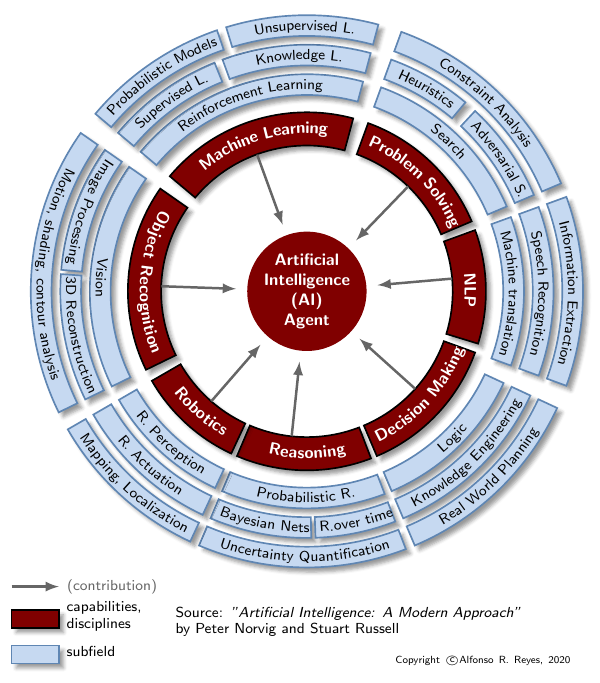
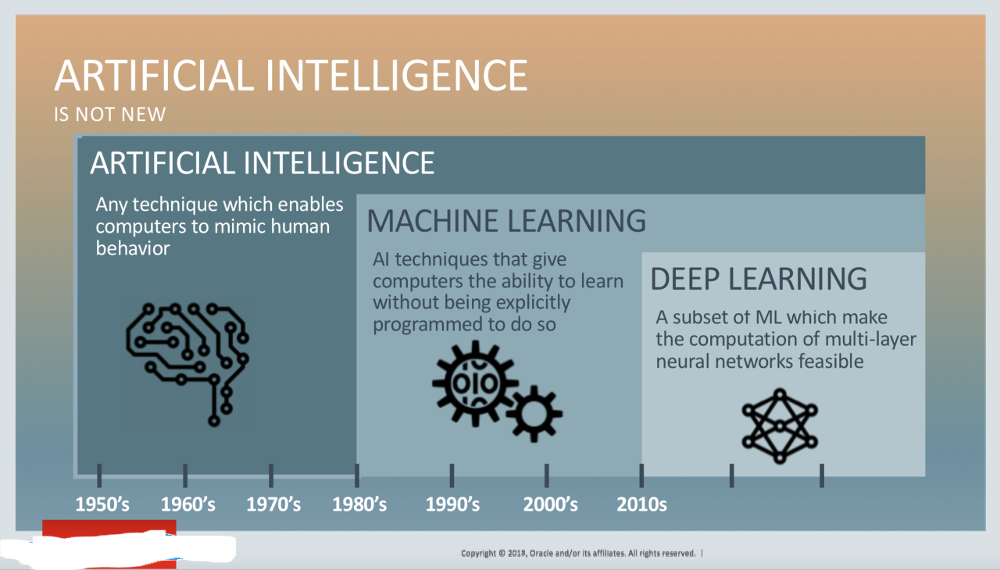
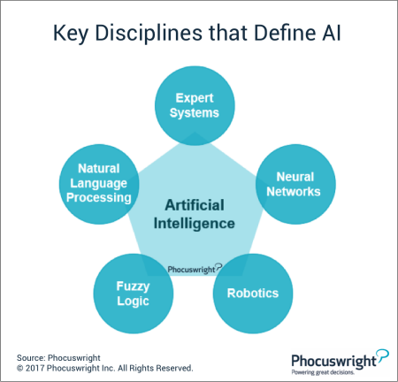

# Why Machine Learning is not Artificial Intelligence?

It is simple: because **ML** is only a contributing branch of **AI**. If we follow Norvig and Russell book -and other authors-, saying that **machine learning** is part of **artificial intelligence** is grossly misleading, **ML** is a contributing discipline of **AI**, just like search, reasoning, decision making, natural language processing, image recognition, robotics, etc. 

For instance, **ML** by itself cannot be intelligent because lacks reasoning, logic, and doesn’t interact with the environment. **ML** detects patterns based on statistical analysis of data using *math based algorithms*. These **algorithms** are not intelligent per se. 

Intelligence is much more than that. 

Stating that **ML** is part of **AI** dramatically lowers the bar of what John McCarthy meant by **AI**. Chapter two of the AIAMA ([Artificial Intelligence: A Modern Approach](http://aima.cs.berkeley.edu/)) book -which counts five editions- contains examples and schematics of what an **AI** agent is. In essence, an **AI agent** perceives its environment by means of **sensors**, and acts upon the **environment** through **actuators**; in between these two, there is logic, reasoning, decision making that makes the agent act autonomously, correcting itself with no human intervention.

The figure is my crude attempt of explaining what the AI contributors are (brown).

## Background

Our first instinct would bring us to say Machine Learning is a **subset** of Artificial intelligence. Then, starts getting fuzzy and nebulous when we find papers, articles, posts claiming to be on Artificial intelligence. You start reading them and turns out they 're about Machine Learning or Data Science. At this point we just don't know, if the author(s) made the mistake by **ignorance** (didn't research or read enough literature), or purposely tried to **deceive** readers. **Commercialism** also plays a huge part in all this. Although, **Machine Learning** has had -still has- **tremendous achievements** to show, **marketing** departments prefer to call it Artificial intelligence.

Books on artificial intelligence DO NOT do that. 
They are written by scientists -generally- with strong ethical codes. 

So, today's Artificial intelligence, Machine Learning, and Data Science atmosphere is charged with **false** stories, **inflated** achievements. That's bad for all of us. Because in the end what we receive is pseudo-science. 

**Science is hard** - it's supposed to be. Artificial intelligence, at the **top** of the food chain, was one of the ultimate frontiers. I'm sure [John McCarthy](http://jmc.stanford.edu/) would not agree to qualify a linear regression, a neural network, or a bare robot, as being Artificial intelligence. Of course, they could be AI with the right combination of components. Machine Learning is only one of them. 

## "You are spreading misinformation ..."

If I may invite you to read ["Artificial Intelligence—The Revolution Hasn’t Happened Yet" by Prof. Michael I. Jordan](https://hdsr.mitpress.mit.edu/pub/wot7mkc1/release/8).

With that clarity that comes from a mixed background of engineering and science, Prof. Jordan diagnose the current state of AI. These are my takeaways.

1- Clearly, there is a **misunderstanding** of the word Artificial Intelligence, not only by the general public but also **scientists**.

2- It is difficult to grasp the concept of AI because **we are living it**. But it's time that universities come up with a career on AI Engineering.

3- Most of the **successes** we attribute to AI are actually **Machine Learning**. All technological leading companies use ML throughout all their business; read Google, Netflix, Facebook, Amazon, Twitter, Microsoft, IBM, etc. 

4- AI originally was meant to focus on the **cognitive capability** of humans. After almost 70 years still remains elusive. 

5- What we call AI today **arose from the fields** of pattern recognition, movement control and statistics. 

6- Although document retrieval, text classification, fraud detection, recommendation systems, personalized search, social network analysis, planning, diagnostics, and A/B testing are not AI but **Machine Learning**, they are **very successful**. And, still we insist in calling them AI.

There is also eye opening interview by Lex Friedman to Prof. Jordan in YouTube. Here is the [link](https://www.youtube.com/watch?v=EYIKy_FM9x0), whom Lex calls "the Miles Davis of Machine Learning".

## The view of Artificial Intelligence by Prof. John McCarthy

Branches of Artificial Intelligence by Prof. John McCarthy

It is interesting to note how the personal computer and computerized  electronics completely warped the AI landscape. If we compare it to the  one by Norvig and Russell, the latter gives way to Robotics, Object  Recognition, Machine Learning, and Natural Language Processing.

It is mind boggling to see Machine Learning, having brought most of the  successes that are attributed to AI, public and general and even  scientists insist in calling it AI. It is not because of the word  "artificial"; we are irremediably fascinated by anything labeled with  "intelligence".

Good part of it is commercialism. 

https://www.linkedin.com/posts/alfonsorreyes_machinelearning-artificialintelligence-datascience-activity-6739357027979677696-ynI2

## The view of AI by Poole, Mackworth and Goebel

## What Artificial Intelligence is not

Definitely the following diagrams do NOT represent what Artificial Intelligence is.

The main flaw is that each of the figures makes it look like Machine Learning is the biggest contributor of AI and makes it a subset of AI, when ML is only a contributing branch of AI.

Here we see the two disciplines Machine Learning and Data Science. They both complement each other but not necessarily intersect with Artificial Intelligence. Data Science is a reciprocal main contributor of Machine Learning but also minor contributor of Natural Language Processing and Object Recognition. ML and DS are fundamental to get a basic understanding of AI.

This diagram is wrong twice. Deep Learning is a subset of Neural Networks. Machine Learning is not a subset of Artificial Intelligence. ML by itself cannot be intelligent.

The **interaction with the environment** called here "technologies physical enablement" does not belong to Machine Learning, it is part of AI. Sensors and actuators (or effectors) are used by Artificial Intelligence to interact with the environment; they are not contributors. Interaction with the environment is another dimension of an AI agent.

I would move Machine Learning circle outside of AI. The other smaller circles (vision, robotics, NLP, should be surrounding AI. Autonomous Vehicles is an application of AI, not a contributing branch.

These all are Machine Learning techniques; they are not AI.

------

## Artificial Intelligence representations

Disciplines such as operations research, problem solving, machine learning, knowledge representation, are all enablers of an **artificial intelligence agent**.

Fuzzy Logic and Neural Networks could have been included in Machine Learning. I am not so sure about Fuzzy Logic. I think it should be in Process Control or Optimization, though. There is some debate there. Same with Genetic Algorithms; not AI but a method also used in ML and Optimization.

Separate is better. Deep Learning should be included in Machine Learning. The two disciplines ML and Data Science complement each other. ML and DS are necessary to get the fundamental understanding of AI.

The arrows should point the other way around. The disciplines around enable AI. I don't know what the author meant by "big data".  Again, neural networks and big data (which is a wrong term), should be in Machine Learning. Speech recognition should be under Natural Language Processing.

Neural Networks and big data should be part of Machine Learning. Arrows should point in direction to AI and no the other way around.

This diagram slightly follows the book "Artificial Intelligence: A Modern Approach" by Peter Norvig and Russell. Neural Networks though has to be moved to Machine Learning.

Computational Intelligence is another preferred term for Artificial Intelligence. This diagram is focused to algorithms that not necessarily belong to Machine Learning but to optimization and process control: Fuzzy Logic, Evolutionary Computing, and Swarm Intelligence. They could be grouped in a common branch but not ML if they don't learn from data.

Computational Intelligence term is also used by some AI scientists instead of Artificial Intelligence.
We see something new here: "physical algorithms" and "immune algorithms". They wouldn't have a branch in my diagram; they are not ML. I will do some research and come up with a common branch.

The following figure needs some grouping but gives the idea of what tools you could use to make an AI agent.
It has good intentions but mixes **applications of AI** with **disciplines** contributing to AI.

A different take on AI, from the point of view of the cognitive mode. I could not find though anything related to decision making, logic, reasoning, or problem solving.

I would just add reasoning, problem solving, and decision making. Deep Learning would go under supervised learning. Although not for long. There have been successes in some types of Generative Adversarial Networks or GANs -some of which use Deep Learning through Convolutional Neural Networks- where the GAN can discriminate and classify unlabeled data.

This is another perspective. What are the disciplines that have made possible Artificial Intelligence. In this diagram we see few. I would add also: Economics, Neuroscience, Computer Engineering, Control Theory, Cybernetics, Linguistics, Statistics.

A different view on classification of contributing branches of AI.

## References

*   "Artificial Intelligence: A Modern Approach" by Peter Norvig and Stuart Russell.
*   "Computational Intelligence: A Logical Approach" by David Poole, Alan Mackworth and Randy Goebel.
*   "What are the branches of AI" by John McCarthy. [Link To Stanford University](http://jmc.stanford.edu/artificial-intelligence/what-is-ai/branches-of-ai.html)