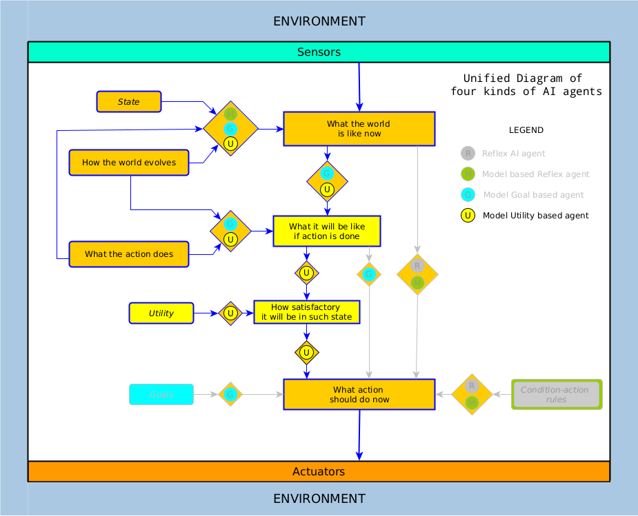

---

---


#  Unified Diagram of four kinds of Artificial Intelligence agents

[toc]


## Introduction

This is my attempt to unify the first four kinds of #AI agents as described in the book "Artificial Intelligence: A Modern Approach", authored by Peter Norvig and Stuart Russell.

There is still a lot of confusion between the terms #machinelearning and #AI, as if they were synonyms. They are different. In fact, many of the successes attributed to AI are machine learning, but the term #intelligence has us all captivated.

The purpose of these diagrams is showing #machinelearning within the context of something bigger: #AI, where #ML is shown as a component -not exclusive- of an AI agent, requiring #reasoning, #rationality and #decisionmaking to be AI.

Originally, each of the four #AIagents is described on its own, although I found it not satisfactory because there were several components in common to all of them. This unified view may help to understand it, or at least gives us a route map of what is needed and put the pieces together to build an AI machine.


## Post at LinkedIn

Thursday December 11, 2020


Thursday December 10, 2020

https://www.linkedin.com/posts/alfonsorreyes_artificialintelligence-ai-aiagent-activity-6742839140678742017-Bnjl


## The Reflex AI agent

This is the simplest of all agents.
It bases its decisions on a set of rules that are evaluated against the conditions that are measured from the world. It is not capable of modifying the rules for an action when an unexpected condition arises.

Nils Nilsson, calls this kind of agent "stimulus-reponse (S-R) agents". They don't keep an internal state but rather react immediately to stimuli in the environment. [Nilsson1998 "Artificial Intelligence: A New Synthesis"].

An example of this agent could be a light seeking robot that moves towards light of moderate intensity and stays away from bright light sources.

Other simple examples of S-R agents are thermostats that keep room temperature, speed cruise control in cars, low level control of IRQ by an operating system, etc. These kind of agents are used as starting point reference although do not constitute the main substance of #artificialintelligence. We are aiming at a higher level of intelligent machines.


## The model-based Reflex AI agent

This is an enhanced version of the Reflex AI agent.
We provide a model that informs the agent how the world is changing when the agent is not in conditions of observing it; and how an action performed by the agent would affect the world.


## The Utility based AI agent

This agent uses an utility function that measures performance or satisfaction for its decisions instead of just pursuing a goal. It evaluates trade offs when goals are conflicting; or weighs the probability of success, according to the importance of the goals, when there is uncertainty of the expected execution of any of the goals.




## The Goal-based AI agent

The goal based agent is  flexible enough to generalize its actions according to the goal that is being set. Also, it is able to modify its knowledge set if the conditions of the world vary during the pursue of its goal.


## Diagram Explanation

In this diagram there are four integrated AI agents:

* the Reflex AI agent

* the model-based reflex agent

* the Goal-based AI agent, and

* the Utility based AI agent

To read the diagram - see what components an AI agent makes use of- follow the conditional symbol (or gate) with the corresponding letter of the agent. 

For instance, the simplest of all agents is the "(R)eflex agent":

1. Start at "Sensors" at the top, 
2. go down by "What the world is like now",
3.  go through the gate "R", 
4. descend on "What action should do now", and
5. arrive to "Actuators" at the bottom. 

That's all it takes to a #ReflexAgent". 

Pay attention to the blueish surroundings which is the "Environment". An example of a Reflex agent would be the earliest generation of the 

#autonomous robotic vacuum cleaner like the Roomba or similar.

The 2nd kind of agent is the "Model-based Reflex" agent. Although it makes use of Conditional-Action rules, it keeps track of the state of the Environment, and its changes after performing an action.


## References

### Book "Artificial Intelligence: A Modern Approach"

The book "Artificial Intelligence: A Modern Approach", authored by Peter Norvig and Stuart Russell is an AI classic used by more 1500 educational institutions around the world. There are some chapters available online, as well as the table of contents and code at its website http://aima.cs.berkeley.edu/

The book is relatively easy to read with lots of historical references to understand artificial intelligence within the context of an aspirational human endeavor for hundreds of years, or thousands, if we include Aristotle -as the authors did- as one of the proto-philosophers of #AI.


## Other

### older versions

```
This is my attempt to unify the four first kinds of AI agents as described in the book "Artificial Intelligence: A Modern Approach", authored by Peter Norvig and Stuart Russell; an AI classic used by more 1500 educational institutions around the world.

Originally, each of the four agents are described in its own schematic, although I was not satisfied because there were several components in common to all of them. This unified view may help to understand it.

To read it - see what components a kind of AI agent makes use of- follow the conditional symbol (or gate) with the corresponding letter of the agent. For instance, the simplest of all agents is the "(R)eflex agent". Start at "Sensors" at the top, go down by "What the world is like now", go through the gate "R", descend on "What action should do now", and arrive to "Actuators" at the bottom. That all it takes to a "Reflex agent". Pay attention to the blueish surroundings which is the "Environment". An example could be the earliest generation of the autonomous vacuum cleaner.

The 2nd kind is the "Model-based Reflex" agent. Although it makes use of C-A rules, it keeps track of the state of the Environment, and the changes after performing an action.
```

